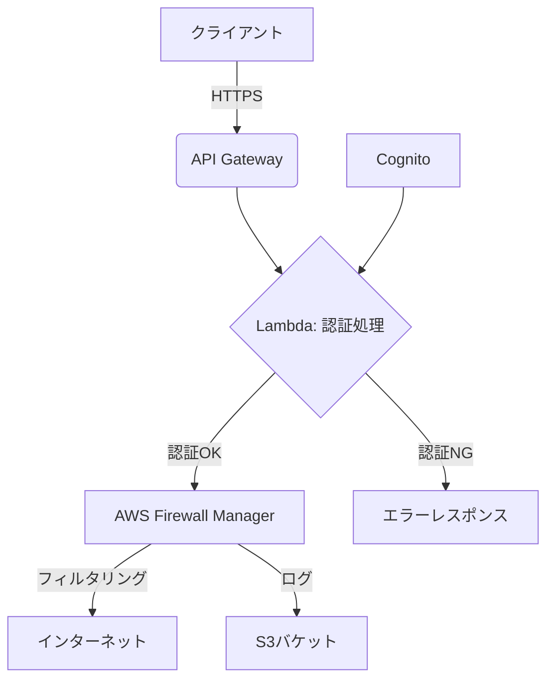

# SASE (Secure Access Service Edge) 環境

このプロジェクトは、AWSを活用したサーバーレスアーキテクチャによるSASE環境の構築を目指しています。セキュアWebゲートウェイ機能を提供し、インターネットへの全トラフィックをフィルタリングします。

## アーキテクチャ概要



### 主要コンポーネント

1.  **API Gateway**: クライアントからのリクエストを受信し、Lambda関数に処理を委譲します。
2.  **Lambda (認証処理)**: Cognitoと連携してクライアントの認証を行います。認証が成功した場合、リクエストをAWS Firewall Managerに転送します。
3.  **Cognito**: ユーザー認証を管理します。
4.  **AWS Firewall Manager**: インターネットトラフィックのフィルタリングを行います。全トラフィックが対象です。
5.  **S3バケット**: Firewall Managerのログを保存します。
6.  **Lambda (ロギング処理)**: 必要に応じて、追加のロギング処理を行います。

### ネットワーク構成

*   VPC: セキュリティグループとサブネットを管理します。
*   セキュリティグループ: Lambda関数やAPI Gatewayへのアクセスを制御します。

### 認証フロー

1.  クライアントがAPI Gatewayにリクエストを送信します。
2.  API GatewayがLambda関数（認証処理）を呼び出します。
3.  Lambda関数がCognitoに認証リクエストを送信します。
4.  Cognitoが認証結果をLambda関数に返します。
5.  認証が成功した場合、Lambda関数がリクエストをAWS Firewall Managerに転送します。
6.  AWS Firewall Managerがトラフィックをフィルタリングし、インターネットに転送します。
7.  Firewall ManagerのログがS3バケットに保存されます。

## ディレクトリ構成

*   `terraform/`: Terraform設定ファイル
*   `lambda/`: Lambda関数のソースコード

## 前提条件

*   AWSアカウント
*   Terraform CLI
*   AWS CLI (認証済み)

## デプロイ手順

1.  **Lambda関数のZIPファイル作成**:
    ```bash
    cd lambda
    zip -r auth_function.zip auth_function.py
    cd ..
    ```

2.  **Terraform初期化**:
    ```bash
    cd terraform
    terraform init
    ```

3.  **Terraformプラン**:
    ```bash
    terraform plan
    ```

4.  **Terraform適用**:
    ```bash
    terraform apply
    ```

5.  **AWS Firewall Managerポリシー設定**:
    *   AWSマネジメントコンソールにログインします。
    *   Firewall Managerサービスに移動します。
    *   新しいポリシーを作成し、`sase-web-acl`を関連付けます。
    *   ポリシーのスコープを適切に設定します（例：特定のアカウント、OU全体など）。

6.  **Cognitoユーザー作成**:
    *   AWSマネジメントコンソールにログインします。
    *   Cognitoサービスに移動します。
    *   `sase-user-pool`にテストユーザーを作成します。

7.  **API Gatewayのカスタムドメイン設定** (オプション):
    *   必要に応じて、API Gatewayにカスタムドメインを設定します。

## 使用方法

1.  Cognitoでユーザー認証を行い、アクセストークンを取得します。
2.  API Gatewayのエンドポイントに、`Authorization: Bearer <アクセストークン>`ヘッダーを付与してリクエストを送信します。
3.  Lambda関数が認証を検証し、AWS Firewall Managerにトラフィックを転送します。
4.  Firewall Managerがトラフィックをフィルタリングし、インターネットに転送します。
5.  ログはS3バケットに保存されます。