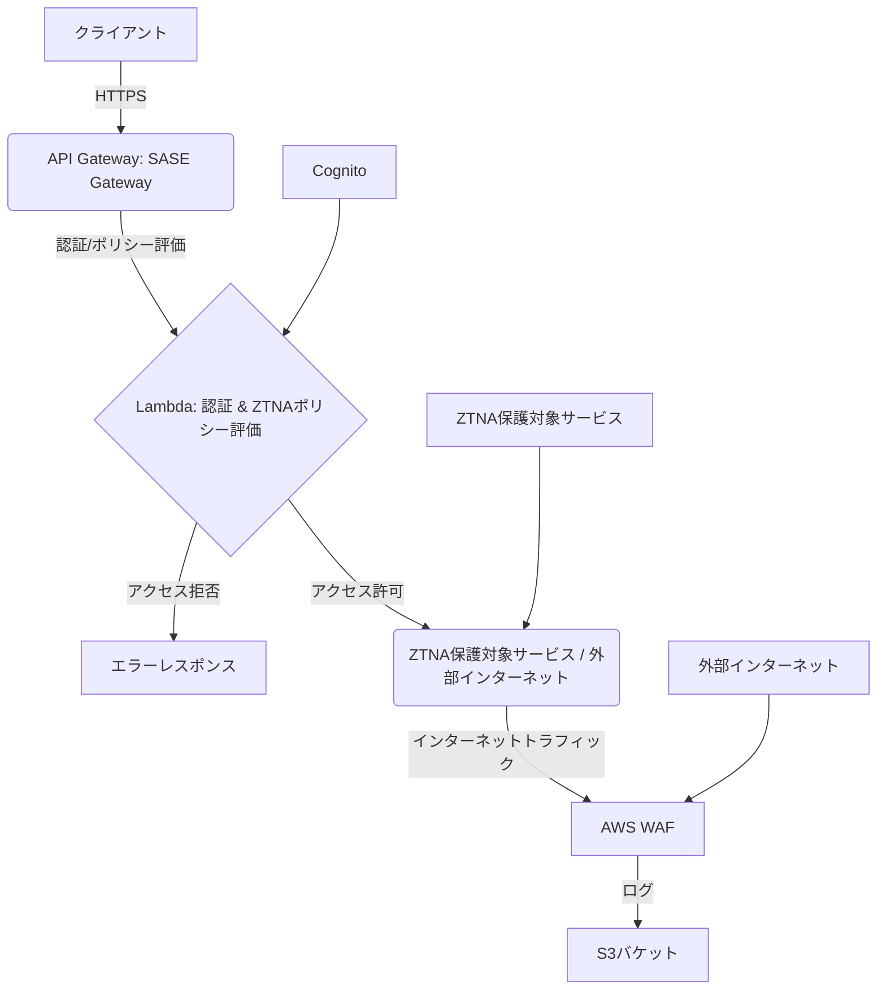

# SASE (Secure Access Service Edge) 環境

このプロジェクトは、AWSを活用したサーバーレスアーキテクチャによるSASE環境の構築を目指しています。セキュアWebゲートウェイ機能を提供し、インターネットへの全トラフィックをフィルタリングします。

## アーキテクチャ概要



### 主要コンポーネント

1.  **API Gateway (SASE Gateway)**: クライアントからのリクエストを受信し、認証Lambda関数に処理を委譲します。
2.  **Lambda (認証処理 & ZTNAポリシー評価)**: Cognitoと連携してクライアントの認証を行い、認証成功後、ユーザーの属性やリクエストに基づいてZTNAポリシーを評価します。ポリシー違反のリクエストは拒否し、許可されたリクエストのみをZTNA保護対象サービスまたはインターネットに転送します。
3.  **Cognito**: ユーザー認証を管理します。
4.  **AWS WAF**: インターネットトラフィックをフィルタリングします。
5.  **S3バケット**: WAFおよびZTNAのログを保存します。
6.  **ZTNA保護対象サービス**: アクセス制御の対象となるバックエンドサービス（例: VPC内のLambda関数とプライベートAPI Gateway）。SASEゲートウェイのLambda関数経由でのみアクセス可能です。

### ネットワーク構成

*   VPC: セキュリティグループ、パブリック/プライベートサブネットを管理します。フローログが有効化されています。
*   セキュリティグループ: Lambda関数、API Gateway、ZTNA保護対象サービスへのアクセスを制御します。
*   VPCエンドポイント: プライベートAPI Gatewayへのセキュアな接続を提供します。

### 認証・ZTNAフロー

1.  クライアントがSASE Gateway (API Gateway) にリクエストを送信します。
2.  API Gatewayが認証Lambda関数（認証処理 & ZTNAポリシー評価）を呼び出します。
3.  Lambda関数がCognitoに認証リクエストを送信し、ユーザーを認証します。
4.  認証成功後、Lambda関数はリクエストのコンテキスト（ユーザー属性、リソースパスなど）に基づき、ZTNAポリシーを評価します。
    *   **例**: `/protectedPath` へのアクセスは特定のCognitoグループ（例: `admin`）に属するユーザーのみに許可されます。
5.  ポリシーがアクセスを許可した場合、Lambda関数は以下のいずれかの方法でリクエストを転送します。
    *   **ZTNA保護対象サービス**: 私用なAPI Gatewayエンドポイントを介して、VPC内のLambda関数など安全なバックエンドサービスへ転送します。
    *   **外部インターネット**: HTTPbinのような外部サービスへ転送します。このトラフィックは引き続きAWS WAFでフィルタリングされます。
6.  ポリシーがアクセスを拒否した場合、Lambda関数は適切なエラーレスポンス（例: 403 Forbidden）を返します。
7.  API Gateway、Lambda、WAFからのログがS3バケットおよびCloudWatch Logsに保存されます。

## ディレクトリ構成

*   `cdk/`: AWS CDK設定ファイル
*   `lambda/`: Lambda関数のソースコード (認証Lambda, 保護されたリソースLambda, 共有レイヤー)

## 前提条件

*   AWSアカウント
*   Node.js & npm (またはYarn)
*   AWS CLI (認証済み)
*   AWS CDK CLI (`npm install -g aws-cdk`)

## デプロイ手順 (AWS CDK)

1.  **依存関係のインストール**:
    ```bash
    npm install
    ```

2.  **Lambdaレイヤーの準備**: `requests`ライブラリをLambdaレイヤーとしてパッケージ化します。
    ```bash
    mkdir -p lambda/layer/python
    pip install -t lambda/layer/python -r lambda/requirements.txt
    cd lambda/layer && zip -r ../requests_layer.zip . && cd ../..
    ```

3.  **AWS CDK環境のブートストラップ**:
    初回デプロイ時のみ必要です。`ACCOUNT_ID`と`AWS_REGION`を実際のAWSアカウントIDとリージョンに置き換えてください。
    ```bash
    npx cdk bootstrap aws://ACCOUNT_ID/AWS_REGION
    ```

4.  **CDKスタックの合成 (CloudFormationテンプレートの生成)**:
    ```bash
    npx cdk synth
    ```

5.  **CDKスタックのデプロイ**:
    ```bash
    npx cdk deploy
    ```
    承認プロンプトが表示された場合は 'y' を入力してください。承認なしでデプロイする場合は `--require-approval never` を追加します。

## 使用方法

1.  **Cognitoユーザーの作成とグループへの追加**:
    *   AWSマネジメントコンソールでCognitoユーザープール `sase-user-pool` に移動します。
    *   テストユーザーを作成します。
    *   オプション: `admin`という名前のグループを作成し、テストユーザーをこのグループに追加すると、`/protectedPath`へのアクセスをテストできます。
2.  **API Gatewayエンドポイントの取得**:
    *   CDKデプロイ後、出力されるAPI GatewayのURL（例: `https://xxxxxxx.execute-api.ap-northeast-1.amazonaws.com/prod/`）をメモします。
3.  **認証とアクセストークンの取得**:
    *   Postmanやcurlなどのツールを使用して、Cognitoユーザープールに対して認証を行い、IDトークンまたはアクセストークンを取得します。認証フローは、Cognitoのホスト型UI、またはAWS Amplify SDKなどを利用できます。
4.  **SASEゲートウェイ経由のアクセス**:
    *   取得したアクセストークンを`Authorization: Bearer <アクセストークン>`ヘッダーに含めて、API Gatewayのエンドポイントにリクエストを送信します。
    *   **インターネットへのアクセス例**:
        ```bash
        curl -H "Authorization: Bearer <アクセストークン>" <API Gateway URL>/get
        ```
        (これはhttpbin.orgの`/get`エンドポイントに転送されます)
    *   **保護されたリソースへのアクセス例 (権限がない場合)**:
        ```bash
        curl -H "Authorization: Bearer <アクセストークン>" <API Gateway URL>/protectedPath/users
        ```
    *   **保護されたリソースへのアクセス例 (adminグループのユーザー)**:
        ```bash
        curl -H "Authorization: Bearer <admin_アクセストークン>" <API Gateway URL>/protectedPath/users
        ```
5.  **ログの確認**:
    *   CloudWatch Logsの`/aws/lambda/sase-auth-function`、`/aws/apigateway/SaseStack-SaseApi-AccessLogs`、`/aws/apigateway/SaseStack-ProtectedApi-AccessLogs`ロググループで、認証とZTNAポリシー評価の結果を確認できます。
    *   S3バケット (`sase-access-logs-<ACCOUNT_ID>`) で、WAFやVPCフローログのログを確認できます。