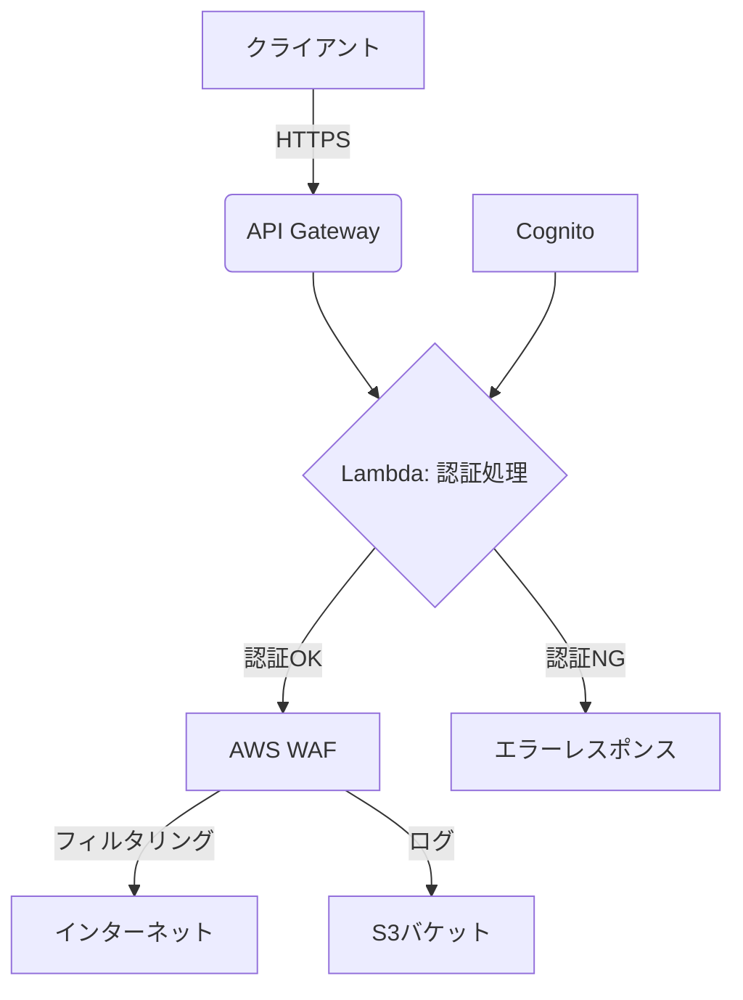

# SASE (Secure Access Service Edge) 環境

このプロジェクトは、AWSを活用したサーバーレスアーキテクチャによるSASE環境の構築を目指しています。セキュアWebゲートウェイ機能を提供し、インターネットへの全トラフィックをフィルタリングします。

## アーキテクチャ概要



### 主要コンポーネント

1.  **API Gateway**: クライアントからのリクエストを受信し、Lambda関数に処理を委譲します。
2.  **Lambda (認証処理)**: Cognitoと連携してクライアントの認証を行います。認証が成功した場合、リクエストをAWS WAFに転送します。
3.  **Cognito**: ユーザー認証を管理します。
4.  **AWS WAF**: インターネットトラフィックのフィルタリングを行います。全トラフィックが対象です。
5.  **S3バケット**: WAFのログを保存します。
6.  **Lambda (ロギング処理)**: 必要に応じて、追加のロギング処理を行います。

### ネットワーク構成

*   VPC: セキュリティグループとサブネットを管理します。
*   セキュリティグループ: Lambda関数やAPI Gatewayへのアクセスを制御します。

### 認証フロー

1.  クライアントがAPI Gatewayにリクエストを送信します。
2.  API GatewayがLambda関数（認証処理）を呼び出します。
3.  Lambda関数がCognitoに認証リクエストを送信します。
4.  Cognitoが認証結果をLambda関数に返します。
5.  認証が成功した場合、Lambda関数がリクエストをAWS WAFに転送します。
6.  AWS WAFがトラフィックをフィルタリングし、インターネットに転送します。
7.  WAFのログがS3バケットに保存されます。

## ディレクトリ構成

*   `cdk/`: AWS CDK設定ファイル
*   `lambda/`: Lambda関数のソースコード

## 前提条件

*   AWSアカウント
*   Node.js & npm (またはYarn)
*   AWS CLI (認証済み)
*   AWS CDK CLI (`npm install -g aws-cdk`)

## デプロイ手順 (AWS CDK)

1.  **依存関係のインストール**:
    ```bash
    npm install
    ```

2.  **AWS CDK環境のブートストラップ**:
    初回デプロイ時のみ必要です。`ACCOUNT_ID`と`AWS_REGION`を実際のAWSアカウントIDとリージョンに置き換えてください。
    ```bash
    npx cdk bootstrap aws://ACCOUNT_ID/AWS_REGION
    ```

3.  **CDKスタックの合成 (CloudFormationテンプレートの生成)**:
    ```bash
    npx cdk synth
    ```

4.  **CDKスタックのデプロイ**:
    ```bash
    npx cdk deploy
    ```
    承認プロンプトが表示された場合は 'y' を入力してください。承認なしでデプロイする場合は `--require-approval never` を追加します。

## 使用方法

1.  Cognitoでユーザー認証を行い、アクセストークンを取得します。
2.  API Gatewayのエンドポイントに、`Authorization: Bearer <アクセストークン>`ヘッダーを付与してリクエストを送信します。
3.  Lambda関数が認証を検証し、AWS WAFにトラフィックを転送します。
4.  WAFがトラフィックをフィルタリングし、インターネットに転送します。
5.  ログはS3バケットに保存されます。